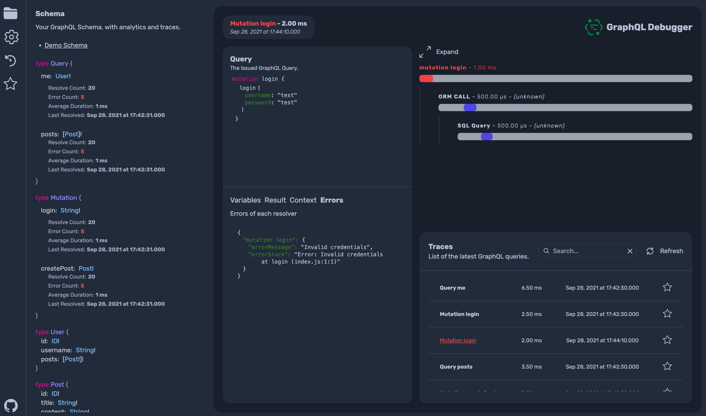

<h1>GraphQL Debugger</h1>

GraphQL Debugger is a platform for debugging your GraphQL Server.

<a href="https://www.graphql-debugger.com/" target="_blank">https://www.graphql-debugger.com/</a>

 

## Documentation

https://www.graphql-debugger.com/docs

## Contributing

https://www.graphql-debugger.com/contributing

## License

MIT - Rocket Connect - https://github.com/rocket-connect
