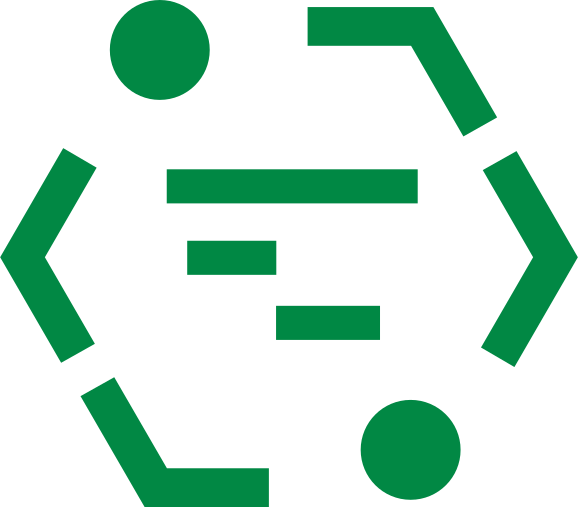
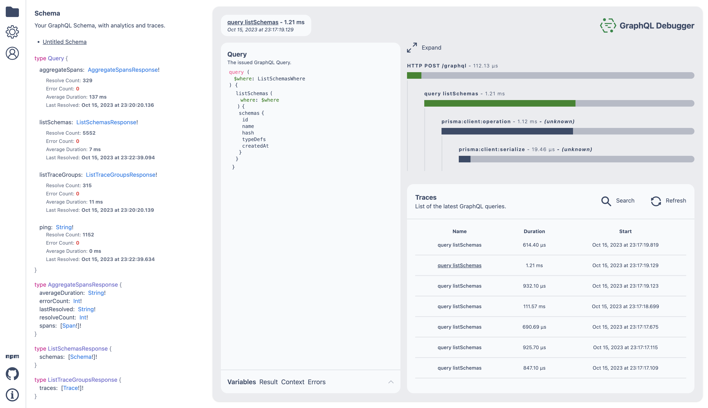

<div align="center" style="text-align: center;">



<h1>GraphQL Debugger</h1>

<p>Debug your GraphQL server locally.</p>

[](https://badge.fury.io/js/graphql-debugger) [](https://opensource.org/licenses/MIT)

[](https://www.graphql-debugger.com/)

</div>

## Watch the talk!

<div align="center" style="text-align: center;">

[](https://youtu.be/EpC6xmw2a6Y)

<p>
  <a href="https://youtu.be/EpC6xmw2a6Y">https://youtu.be/EpC6xmw2a6Y</a>
</p>

</div>

## About

GraphQL Debugger is a [Open Telemetry](https://opentelemetry.io/) collector with a user interface that is tailored for debugging GraphQL servers.

It is designed to be used during development, to help you spot errors, slow queries and inconsistencies without having to use console.log.

To get started, use the [trace schema package](https://github.com/rocket-connect/graphql-debugger/tree/main/packages/trace-schema) to trace your schema, and then run the GraphQL Debugger CLI to start debugging:

```
npx graphql-debugger
```

## Contributing

We welcome contributions to GraphQL Debugger.

Please read our [contributing guide](./docs/CONTRIBUTING.md) to get started.

## Getting Started

### Install

Install the GraphQL Debugger CLI and trace schema package.

```
npm i graphql-debugger @graphql-debugger/trace-schema
```

### Trace your schema

```ts
import {
  GraphQLOTELContext,
  traceSchema,
} from "@graphql-debugger/trace-schema";

import { makeExecutableSchema } from "@graphql-tools/schema";
import { createYoga } from "graphql-yoga";

// Common GraphQL schema
const schema = makeExecutableSchema({
  typeDefs,
  resolvers,
});

// Wrap all resolvers and fields with tracing
const tracedSchema = traceSchema({
  schema,
});

const yoga = createYoga({
  schema: tracedSchema,
  context: (req) => {
    return {
      GraphQLOTELContext: new GraphQLOTELContext(),
    };
  },
});
```

### Run the Debugger

```
npx graphql-debugger
```

Navgiating to [http://localhost:16686](http://localhost:16686) will open the GraphQL Debugger UI.

## Advanced

### 3rd Party Tracing

GraphQL debugger supports the usage of other instrumentation libraries. This means that any span that is propogated inside a trace resolver will be picked up by GraphQL Debugger. To enable this, you need to pass in instrumentations to `traceSchema`. Below is an example with Prisma.

#### Prisma

- https://www.prisma.io/docs/concepts/components/prisma-client/opentelemetry-tracing

To use Prisma with GraphQL Debugger, you need to pass in the Prisma instrumentation to `traceSchema`.

```ts
import { traceSchema } from "@graphql-debugger/trace-schema";

import { PrismaInstrumentation } from "@prisma/instrumentation";

const tracedSchema = traceSchema({
  schema,
  instrumentations: [new PrismaInstrumentation()],
});
```

### Plugins

GraphQL debugger supports plugins. Plugins can be used to add additional spans to a trace.

#### Express

The express plugin will add a span at the root of the trace for each http request to your GraphQL server.

```ts
import { graphqlDebugger } from "@graphql-debugger/plugin-express";

import express, { Express } from "express";
import { yoga } from "graphql-yoga";
import path from "path";

export const app: Express = express();
app.use(express.json());
app.use(graphqlDebugger()); // <--- Add plugin
app.use("/graphql", yoga);
```

### Debugger Client

The client is a typescript package that can be used to read and write, traces, spans and schemas to GraphQL Debugger. The client is used internally and is shipped to npm. You can use it to build your own tooling on top of GraphQL Debugger.

```ts
import { DebuggerClient } from "@graphql-debugger/client";

const client = new DebuggerClient();

const spans = await client.span.findMany();
```

## License

MIT - Rocket Connect - https://github.com/rocket-connect
